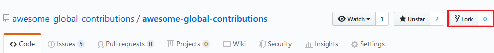

# Contribution Guideline

First up, thank you for wanting to contribute to this project :).
This document will guide you through all the steps necessary in
order to add your project to this list.
If you encounter problems while doing so, please don't hesitate
to open an issue.

## First step: Fork this repository

Since we auto-generate a few files, it's not possible to use
GitHub's online editor to add new projects.

Therefore, you will first have to fork and clone the repository.
Then commit all of your changes on a new branch named
`proj/<project name>`.

For this, you first have to click `fork` on the top right.



[Then clone the repository](https://help.github.com/en/articles/cloning-a-repository)
and finally use a [new branch](https://help.github.com/en/desktop/contributing-to-projects/creating-a-branch-for-your-work)
to work on.
This will be necessary for the pull request in the
[last step](#fourth-and-last-step-create-a-pull-request)

## Second step: Add your Project details

Simply copy the file [`ENTRY_TEMPLATE.yaml`](./ENTRY_TEMPLATE.yaml) into the `src` folder
file and rename it to use the name of your project
(e.g. `my_awesome_project.yaml`).

The single entries are further explained below.
You can also find an [example result](#Example-based-on-this-project)
that uses our project as a baseline.

> TODO: Depends on [interface of the converter](https://github.com/awesome-global-contributions/awesome-global-contributions/issues/8)
>
> Will the parser also show error messages for invalid files?

### Necessary information

These include all of the information that have to be provided, if
the project should be added to this list.

- `name`: The name of the project
- `description`: This description will be presented in the markdown
    file and on the website.
    Explain why the project is awesome and why somebody might want
    to contribute to it
- `globalIssues`: This is a list of fitting issue, corresponding
    with the headings of the README.
    The project will be listed under each issue.
    For a full list of issues see [\<somewhere\>]().
    > TODO: Define list of global issues
- `license`: Simply fill out the name of the license the project uses.
- `programmingLanguages`: List all of the programming languages, that
    the project uses.
    They have to be all lowercase and can use special characters
    (for example: `c#`, `javascript`)
- `repoUrl`: The URL to the repository of the project.
    This should lead you directly to the code.
- `websiteUrl`: The URL for the website of the project.
    If it doesn't have one, simply use the README of the project.
- `rating`: The friendliness rating of the project.
    Currently a 0-10 Likert scale. You should probably do this last.
    <!-- See the [guide]() to know what number to give it. -->
    > TODO: Define ratings

### Overwrite Information

We will try to automatically extrapolate some of the information based
on the ones already provided.
Since the project may be hosted on any website, this is not always possible.
For those from unsupported sites, you will need to fill out the
following items:

- `contributionGuidelinesUrl`: The URL to the contribution guidelines
    of the project.
- `logoUrl`: The URL to an image file that represents the logo of the
    project
- `starsUrl`: The Github stars link.
    Currently looks like `https://img.shields.io/github/stars/org/project.svg?style=social&label=Star&maxAge=2592000`.
    Images from other websites could also be added here.
- `numberContributors`: We regularly, automatically update the number
    of contributors.
    For this, you will have to provide a `url`, a `format` and a `accessor`.
    The script will call the URL and interpret the answer as either a JSON,
    YAML or XML file, based on the given `format`.

    The `accessor` defines how the script will interpret the resulting data.
    Valid values are: `list`, `number` and any string after a `?`
    For a list, it will count the entries and use that as the number of
    collaborators.
    When `number` is specified, it will expect the returned data to be a
    integer.
    The last option is to specify the property that will be tried to be read.

    Following is a short example of an answer and the corresponding correct
    configuration:
    ```json
    {
        "name": "example return data",
        "numberOfContributors": 14
    }
    ```
    ```yaml
    # Project configuration
    numberContributors:
        url: "https://my.awesome.project.io/api/meta-data.json"
        format: json
        accessor: "?numberOfContributors"
    ```

### Optional fields

The following elements will not lead to an error when they are not present.
If possible, they should still be filled out, but not every project will provide
the necessary data.

- `ratingComment`: A comment on the given rating
- `licenseUrl`: Link to the license of the project.
- `sdgs`: The [SDGs](https://www.undp.org/content/undp/en/home/sustainable-development-goals.html)
    that can be associated with the project.
    It's a simple list of the numbers of the goals.
- `naturalLanguages`: While the most common language for international projects
    is English, this list hosts projects from everywhere in the world.
    List all languages that the project's company communicates in.
    (It's not necessary that the code is written in that language)
- `otherLinks`: Object with `name`, `description` and `link`.
    If you have any other interesting links relating to the project that do not
    fit into any of the other fields, feel free to add them here.

### Example based on this project

This is how the entry would look for this project:

```yaml
---
name: awesome-global-contributions
description: >
    Awesome-global-contributions list a number of
    open source projects dedicated to tackling global
    challenges and ultimately better the world.
license: CC0
programmingLanguages:
  - markdown
  - bash
rating: 5
repoUrl: "https://github.com/awesome-global-contributions/awesome-global-contributions"
sdgs: [9, 17]
websiteUrl: "https://github.com/awesome-global-contributions/awesome-global-contributions"

contributionGuidelinesUrl: "https://github.com/awesome-global-contributions/awesome-global-contributions/blob/master/CONTRIBUTING.md"
logoUrl: ""
starsUrl: "https://img.shields.io/github/stars/awesome-global-contributions/awesome-global-contributions.svg?style=social&label=Star&maxAge=2592000"
numberContributors:
  url: "https://api.github.com/repos/awesome-global-contributions/awesome-global-contributions/stats/contributors"
  format: json
  accessor: list

licenseUrl: "https://github.com/awesome-global-contributions/awesome-global-contributions/blob/master/LICENSE"
naturalLanguages:
  - English
```

> TODO: Add proper issues, website link and logoUrl

## Third step: Auto-Generate files

Requirements:
* Python 3
* [yq](https://github.com/kislyuk/yq)

Steps:
```sh
$ ./bin/yaml2markdown.sh
```

## Fourth and last step: Create a pull request

First commit using the commit template and then push to your own fork.

Afterwards navigate to the [original repository](https://github.com/awesome-global-contributions/awesome-global-contributions)
and create a [pull request](https://help.github.com/en/articles/creating-a-pull-request-from-a-fork).
If you've followed all of the formatting rules and your project does meet the
requirements, a maintainer will integrate it into the list.
Otherwise you will be contacted.
